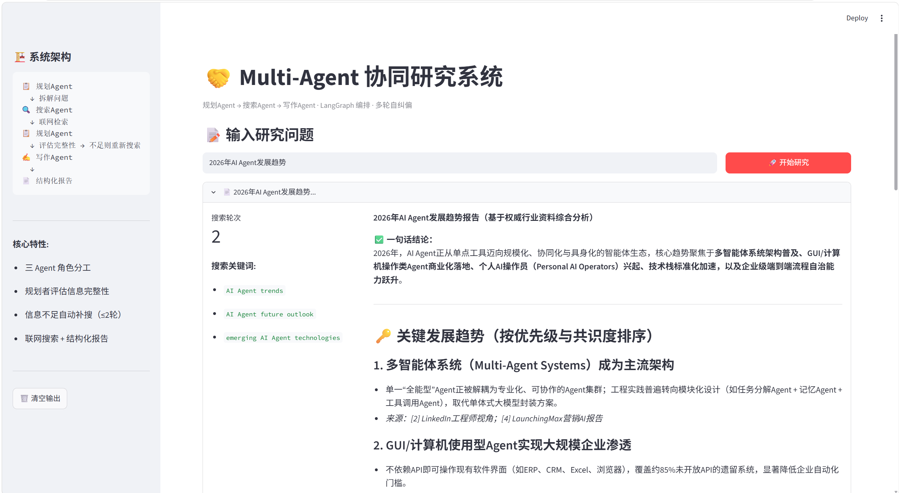
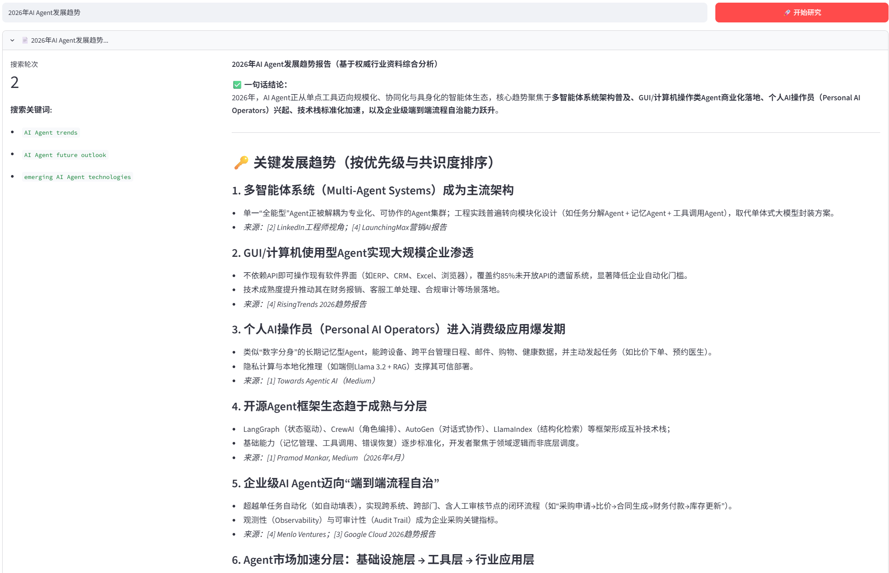

# 🤝 Multi-Agent 协同研究系统

[](https://python.org)
[](https://langchain.com)
[](https://streamlit.io)
[](LICENSE)

基于 **LangGraph StateGraph** 构建的 Multi-Agent 协同系统。三个专业化 Agent（规划者、搜索者、写作者）通过有状态图编排协作，完成复杂信息研究任务，支持**自主评估信息完整性、多轮纠偏补搜、结构化报告生成**。

---

## 🧠 架构

```
用户问题
   │
   ▼
┌──────────────────────────────────────────────────┐
│                 LangGraph StateGraph               │
│                                                    │
│   ┌──────────┐     ┌──────────┐     ┌──────────┐  │
│   │ 📋 规划者  │────▶│ 🔍 搜索者  │────▶│ ✍️ 写作者  │  │
│   │ Planner  │◀────│ Searcher │     │ Writer   │  │
│   └──────────┘     └──────────┘     └──────────┘  │
│        │                                    │       │
│   信息不足 → 重规划补搜（≤2轮）                │       │
│                                                    │
└──────────────────────────────────────────────────┘
   │
   ▼
📄 结构化分析报告（含来源引用）
```

### Agent 角色

| Agent | 职责 | 能力 |
|---|---|---|
| 📋 **规划者** Planner | 拆解问题、制定搜索计划 | 问题分析 → 关键词生成 → 信息完整性评估 |
| 🔍 **搜索者** Searcher | 联网检索、信息提取 | DuckDuckGo 搜索 → 关键信息筛选 → 结构化整理 |
| ✍️ **写作者** Writer | 整合信息、生成报告 | 多源信息融合 → 结构化报告 → 来源标注 |

### 自纠偏机制

规划者在每轮搜索后**重新评估信息完整性**：发现信息不足 → 自动制定补充搜索计划 → 重新调度搜索者（最多 2 轮）。

---

## 🚀 快速开始

### 1. 克隆

```bash
git clone https://github.com/JiaLuo-codes/multi-agent-collab.git
cd multi-agent-collab
```

### 2. 安装依赖

```bash
pip install -r requirements.txt
```

### 3. 配置 API 密钥

```bash
cp .env.example .env
# 编辑 .env，填入 API 密钥
```

| 提供商 | 注册链接 | 免费额度 |
|---|---|---|
| 通义千问 | [dashscope.aliyun.com](https://dashscope.aliyun.com/) | 新用户 100 万 Token |
| DeepSeek | [platform.deepseek.com](https://platform.deepseek.com/api_keys) | 注册赠送额度 |

**默认使用通义千问**，编辑 `config.py` 可切换模型。

### 4. 启动

```bash
# Web 界面
streamlit run app.py

# 命令行测试
python graph.py
```

浏览器打开 `http://localhost:8501`。

---

## 💬 效果示例





---

## 📁 项目结构

```
multi-agent-collab/
├── graph.py          # LangGraph StateGraph 编排（核心）
├── tools.py          # 工具定义（联网搜索）
├── config.py         # LLM 配置（一行切换模型）
├── app.py            # Streamlit Web 界面
├── .env.example      # API 密钥模板
├── requirements.txt  # 依赖列表
└── README.md         # 本文档
```

---

## 🔧 技术栈

- **LangGraph** —— Agent 状态图编排（StateGraph + 条件路由）
- **LangChain** —— LLM 调用、工具定义
- **通义千问 (Qwen-Plus)** —— 大语言模型后端
- **DuckDuckGo** —— 免费联网搜索（无需 API Key）
- **Streamlit** —— Web 交互界面
- **Python** —— 全部逻辑实现

---

## 📝 关键设计决策

1. **为什么用 LangGraph 而非手动串行调用？** —— StateGraph 提供了显式的状态管理、条件路由和循环控制，Agent 之间的流转逻辑清晰可维护，且天然支持中断/恢复。
2. **为什么规划者要评估信息完整性？** —— 这是 Multi-Agent 区别于"串行调三个 LLM"的核心：规划者根据搜索结果动态调整策略，而非盲目执行固定流程。
3. **为什么限制 2 轮搜索？** —— 平衡信息充分性与响应速度。实际场景中可根据需求配置。

---

*Built with LangGraph + Qwen + DuckDuckGo*
